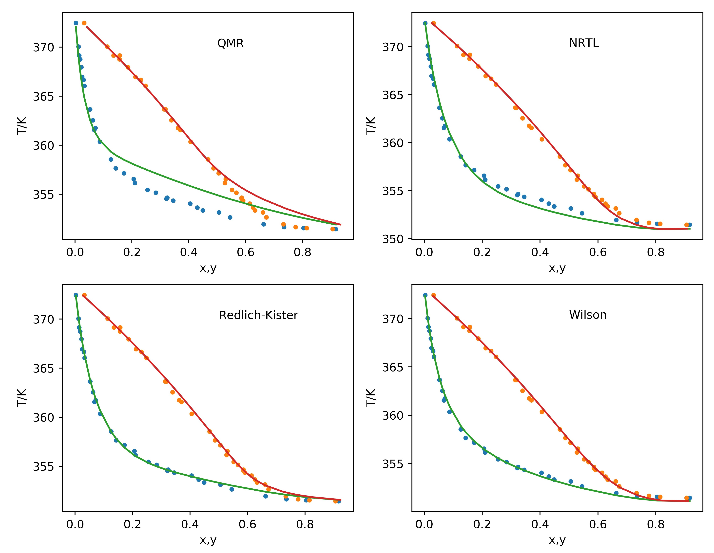

Equilibrium data
================

Phasepy includes function to fit models for phase equilibria of binary mixtures, the fitted parameters by pairs can be used then with mixtures containing more components. Depending and model, there might be more of one type of phase equilibria. Suppose that the parameters model are represented by :math:`\underline{\xi}`, the phasepy functions will fit the given experimental data with the followings objectives functions:

If there is Vapor-Liquid Equilibria (VLE):

.. math::
	FO_{VLE}(\underline{\xi}) = \sum_{j=1}^{Np} \left[ \sum_{i=1}^c (y_{i,j}^{cal} - y_{i,j}^{exp})^2 + \left( \frac{P_{j}^{cal}}{P_{j}^{exp}} - 1\right)^2 \right]

If there is Liquid-Liquid Equilibria (LLE):

.. math::
	FO_{LLE}(\underline{\xi}) = \sum_{j=1}^{Np} \sum_{i=1}^c  \left[(x_{i,j} - x_{i,j}^{exp})^2 +  (w_{i,j} - w_{i,j}^{exp})^2 \right]

If there is Vapor-Liquid-Liquid Equilibria (VLLE):

.. math::
	FO_{VLLE}(\underline{\xi}) = \sum_{j=1}^{Np} \left[ \sum_{i=1}^c  \left[ (x_{i,j}^{cal} - x_{i,j}^{exp})^2 +  (w_{i,j}^{cal} - w_{i,j}^{exp})^2 +  (y_{i,j}^{cal} - y_{i,j}^{exp})^2 \right] + \left( \frac{P_{j}^{cal}}{P_{j}^{exp}} - 1\right)^2 \right]

If there is more than one type of phase equilibria, Phasepy will sum the errors of each one.
As an example the parameters for the system of ethanol and water will be fitted, first the experimental data has to be loaded and then set up as a tuple as if shown in the following code block.

>>> #Vapor Liquid equilibria data obtanied from Rieder, Robert M. y A. Ralph Thompson (1949).
>>> # Vapor-Liquid Equilibria Measured by a GillespieStill - Ethyl Alcohol - Water System.
>>> #Ind. Eng. Chem. 41.12, 2905-2908.
>>> datavle = (Xexp, Yexp, Texp, Pexp)

If the system exhibits any other type phase equilibria the necessary tuples would have the following form:
>>> datalle = (Xexp, Wexp, Texp, Pexp)
>>> datavlle = (Xexp, Wexp, Yexp, Texp, Pexp)

Here, ``Xexp``, ``Wexp`` and ``Yexp`` are experimental mole fraction for liquid, liquid and vapor phase, respectively. ``Texp`` and ``Pexp`` are experimental temperature and pressure, respectively.

After the experimental data is available, the mixture with the components is created.

>>> water = component(name = 'Water', Tc = 647.13, Pc = 220.55, Zc = 0.229,
... Vc = 55.948, w = 0.344861, ksv = [ 0.87292043, -0.06844994],
... Ant =  [  11.72091059, 3852.20302815,  -44.10441047])
>>> ethanol = component(name = 'Ethanol', Tc = 514.0, Pc = 61.37, Zc = 0.241,
... Vc = 168.0, w = 0.643558, ksv = [1.27092923, 0.0440421 ],
... Ant = [  12.26474221, 3851.89284329,  -36.99114863])
>>> mix = mixture(ethanol, water)

Fitting QMR mixing rule
-----------------------

As an scalar is been fitted, SciPy recommends to give a certain interval where the minimum could be found, the function ``fit_kij`` handles this optimization as follows:

>>> from phasepy.fit import fit_kij
>>> mixkij = mix.copy()
>>> fit_kij((-0.15, -0.05), prsveos, mixkij, datavle)
>>> #optimized kij value
>>> -0.10726854855665718

.. automodule:: phasepy.fit.binaryfit
    :members: fit_kij
    :undoc-members:
    :show-inheritance:
    :noindex:

Fitting NRTL parameters
-----------------------

As an array is been fitted, multidimentional optimization alogirthms are used, the function ``fit_nrtl`` handles this optimization with several options available. If a fixed value of the aleatory factor is used the initial guess has the following form:

>>> nrtl0 = np.array([A12, A21])

>>> from phasepy.fit import fit_nrtl
>>> mixnrtl = mix.copy()
>>> #Initial guess of A12, A21
>>> nrtl0 = np.array([-80.,  650.])
>>> fit_nrtl(nrtl0, mixnrtl, datavle, alpha_fixed = True)
>>> #optimized values
>>> [-84.77530335, 648.78439102]

By default bubble points using activity coefficient models use Tsonopoulos virial correlation, if desired ideal gas or Abbott correlation can be used.

>>> from phasepy import ideal_gas, Abbott
>>> #Initial guess of A12, A21
>>> nrtl0 = np.array([-80.,  650.])
>>> fit_nrtl(nrtl0, mixnrtl, datavle, alpha_fixed = True, virialmodel = 'ideal_gas')
>>> #optimized values
>>> [-86.22483806, 647.6320968 ]
>>> fit_nrtl(nrtl0, mixnrtl, datavle, alpha_fixed = True, virialmodel = 'Abbott')
>>> #optimized values
>>> [-84.81672981, 648.75311712]

By default the aleatory factor is set to 0.2, this value ca be changed by passing another value to ``alpha0`` to the fitting function.

>>> fit_nrtl(nrtl0, mixnrtl, datavle, alpha_fixed = True, alpha0 = 0.3)
>>> #optimized values
>>> [-57.38407954, 664.29319445]

If the aleatory factor needs to be optimized it can be included setting alpha_fixed to False, in this case the initial guess has the following form:

>>> nrtl0 = np.array([A12, A21, alpha])

>>> #Initial guess of A12, A21
>>> nrtl0 = np.array([-80.,  650.,  0.2])
>>> fit_nrtl(nrtl0, mixnrtl, datavle, alpha_fixed = False)
>>> #optimized values for A12, A21, alpha
>>> [-5.53112687e+01,  6.72701992e+02,  3.19740734e-01]

Temperature dependent parameters can be fitted setting the option Tdep = True in ``fit_nrtl``, when this option is used the parameters are computed as:

.. math::
	A12 = A12_0 + A12_1  T \\
	A21 = A21_0 + A21_1  T

The initial guess passed to the fit function has the following form:

>>> nrtl0 = np.array([A12_0, A21_0, A12_1, A21_1, alpha])

or, if alpha fixed is used.

>>> nrtl0 = np.array([A12_0, A21_0, A12_1, A21_1])

.. automodule:: phasepy.fit.binaryfit
    :members: fit_nrtl
    :undoc-members:
    :show-inheritance:
    :noindex:

Fitting Wilson's model parameters
---------------------------------

As an array is been fitted, multidimentional optimization alogirthms are used, the function ``fit_wilson`` handles this optimization.

>>> from phasepy.fit import fit_wilson
>>> mixwilson = mix.copy()
>>> #Initial guess of A12, A21
>>> wilson0 = np.array([-80.,  650.])
>>> fit_wilson(wilson0, mixwilson, datavle)
>>> #optimized values
>>> [163.79243953, 497.05518499]

Tsonopoulos virial correlation is used by default, if desired ideal gas or Abbott correlation can be used.

>>> fit_wilson(wilson0, mixwilson, datavle, virialmodel = 'ideal_gas')
>>> #optimized value
>>> [105.42279401, 517.2221969 ]

.. automodule:: phasepy.fit.binaryfit
    :members: fit_wilson
    :undoc-members:
    :show-inheritance:
    :noindex:

Fitting Redlich-Kister interaction parameters
---------------------------------------------

As an array is been fitted, multidimentional optimization alogirthms are used, the function ``fit_rk`` handles this optimization. Redlich-Kister expansion is programmed for n terms of the expansion, this fitting function will optimize considering the lenght of the array passed as an initial guess.

If rk0 is an scalar it reduced to Porter model, if it is array of size 2 it reduces to Margules Model.

>>> from phasepy.fit import fit_rk
>>> mixrk = mix.copy()
>>> rk0 = np.array([0, 0])
>>> fit_rk(rk0, mixrk, datavle, Tdep =  False)
>>> #optimized values
>>> [ 1.1759649 , -0.44487888]

Temperature dependent parameters can be fitted in which case the initial guess will be splitted into two arrays.

>>> c, c1 = np.split(rk0, 2)

Finally the parameters are computed as :math:`G = c + c1/T`.

Similarly as NRTl and Wilson's model, virial correlation can be changed by passing the desired function to the ``virialmodel`` argument.

>>> fit_rk(rk0, mixrk, datavle, Tdep =  False, virialmodel = 'ideal_gas')
>>> [ 1.16854714, -0.43874371]

.. automodule:: phasepy.fit.binaryfit
    :members: fit_rk
    :undoc-members:
    :show-inheritance:
    :noindex:

Multidimentional minimization in SciPy are perfomed with ``minimize`` function, aditional command can be passed to this function in order to change tolerance, number of function evaluations or mimization method. This is done by passing a dictionary with the settings to ``minimize_options`` in ``fit_nrtl``, ``fit_wilson`` or ``fit_rk``. For example:

>>> #changing the minimization method
>>> minimize_options = {'method' : 'Powell'}
>>> fit_rk(rk0, mixrk, datavle, Tdep =  False, minimize_options = minimize_options )

The fitted parameters can be compared against the equilibrium data for each model. The following figure shows the perfomance of QMR, NRTL model, Wilson model and Redlich Kister expansion.

