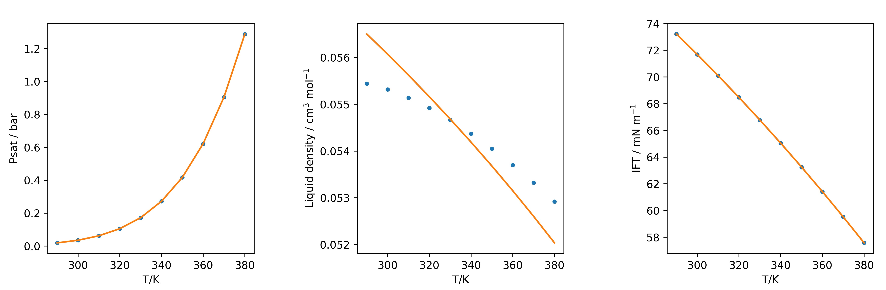

Pure component data
===================

Depending on the model that will be used, different information might be needed. For general purposes there might be necessary to fit saturation pressure, liquid density and interfacial tension. Experimental data is needed, in this case water saturation properties is obtanied from NIST database, more experimental data can be found in DIPPR, TDE, Knovel or by your own measurements.

>>> #Experimental Saturation Data of water obtained from NIST
>>> #Saturation Temperature in Kelvin
>>> Tsat = np.array([290., 300., 310., 320., 330., 340., 350.,
...  360., 370., 380.]) 
>>> #Saturation Pressure in bar
>>> Psat = np.array([0.0192  , 0.035368, 0.062311, 0.10546 , 
... 0.17213 , 0.27188 , 0.41682 , 0.62194 , 0.90535 , 1.2885  ])
>>> #Saturated Liquid density in mol/cm3
>>> rhol = np.array([0.05544 , 0.055315, 0.055139, 0.054919, 
... 0.054662, 0.054371, 0.054049, 0.053698, 0.053321, 0.052918]) 
>>> #Interfacial Tension in mN/m
>>> tension = np.array([73.21 , 71.686, 70.106, 68.47 , 66.781, 
... 65.04 , 63.248, 61.406, 59.517, 57.581])

Saturation Pressure
-------------------

First, Antoine Coefficients can be fitted to the following form:

.. math::
	\ln P = A - \frac{B}{T + C}

The model is fitted directly with Phasepy, optionally an initial guess can be passed.

>>> #Fitting Antoine Coefficients
>>> from phasepy.fit import fit_ant
>>> Ant = fit_ant(Tsat, Psat)
>>> #Objection function value, Antoine Parameters
>>> 5.1205342479858257e-05, [1.34826650e+01, 5.02634690e+03, 9.07664231e-04]
>>> #Optionally an initial guess for the parameters can be passed to the function
>>> Ant = fit_ant(Tsat, Psat, x0 = [11, 3800, -44])
>>> #Objection function value, Antoine Parameters
>>> 2.423780448316938e-07,[ 11.6573823 , 3800.11357063,  -46.77260501]

.. automodule:: phasepy.fit.fitpsat
    :members: fit_ant
    :undoc-members:
    :show-inheritance:
    :noindex:

Following with saturation pressure fitting, when using PRSV EoS
it is necessary to fit :math:`\alpha` parameters, for these purpose a component has to be defined and then using the experimental data the parameters can be fitted.

.. math::
 \alpha = (1 + k_1 [1 - \sqrt{T_r}] + k_2 [1- T_r][0.7 - T_r])^2 

>>> #Fitting ksv for PRSV EoS
>>> from phasepy.fit import fit_ksv
>>> #parameters of pure component obtained from DIPPR
>>> name = 'water'
>>> Tc = 647.13 #K
>>> Pc = 220.55 #bar
>>> Zc = 0.229
>>> Vc = 55.948 #cm3/mol
>>> w = 0.344861
>>> pure = component(name = name, Tc = Tc, Pc = Pc, Zc = Zc, 
... Vc =  Vc, w = w)
>>> ksv = fit_ksv(pure, Tsat, Psat)
>>> #Objection function value, ksv Parameters
>>> 1.5233471126821199e-10, [ 0.87185176, -0.06621339]

.. automodule:: phasepy.fit.fitpsat
    :members: fit_ksv
    :undoc-members:
    :show-inheritance:
    :noindex:

Volume Translation
------------------

When working with cubic EoS, there might an interest for a better prediction of liquid densities, this can be done by a volume translation. This volume correction doesn't change equilibria results and its parameters is obtained in Phasepy as follows:

>>> from phasepy import prsveos
>>> from phasepy.fit import fit_vt
>>> #Defining the component with the optimized alpha parameters
>>> pure = component(name = name, Tc = Tc, Pc = Pc, Zc = Zc,
...  Vc = Vc, w = w, ksv = [ 0.87185176, -0.06621339] )
>>> vt = fit_vt(pure, prsveos, Tsat, Psat, rhol)
>>> #Objetive function and volume translation
>>> 0.001270834833817397, 3.46862174

.. automodule:: phasepy.fit.fitvt
    :members: fit_vt
    :undoc-members:
    :show-inheritance:
    :noindex:

Influence parameter for SGT
---------------------------

Finally, influence parameters are necessary to compute interfacial properties, these can be fitted with experimental interfacial tension. 

>>> from phasepy.fit import fit_cii
>>> #Defining the component with the volume traslation parameter.
>>> pure = component(name = name, Tc = Tc, Pc = Pc, Zc = Zc, 
... Vc = Vc, w = w, ksv = [ 0.87185176, -0.06621339], c =  3.46862174)
>>> eos = prsveos(pure, volume_translation = False)
>>> cii = fit_cii(tension, Tsat, eos, order = 2)
>>> #fitted influence parameter polynomial
>>> [2.06553362e-26, 2.64204784e-23, 4.10320513e-21]

Beware that influence parameter in cubic EoS absorbs density deviations from experimental data, if there is any volume correction the influence parameter will change. 

>>> eos = prsveos(pure, volume_translation = True)
>>> cii = fit_cii(tension, Tsat, eos, order = 2)
>>> #fitted influence parameter polynomial with volume translation
>>> [2.74008872e-26, 1.23088986e-23, 3.05681188e-21]

.. automodule:: phasepy.fit.fitcii
    :members: fit_cii
    :undoc-members:
    :show-inheritance:
    :noindex:

The perfomance of the fitted interaction parameters can be compared against the experimental data (dots), the following figure shows the behavior of the cubic EoS for the saturation pressure, liquid density and interfacial tension (oranges lines).

