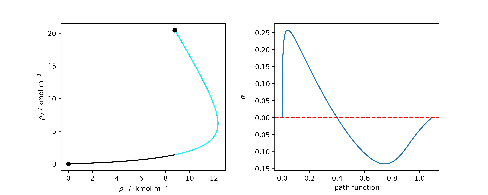
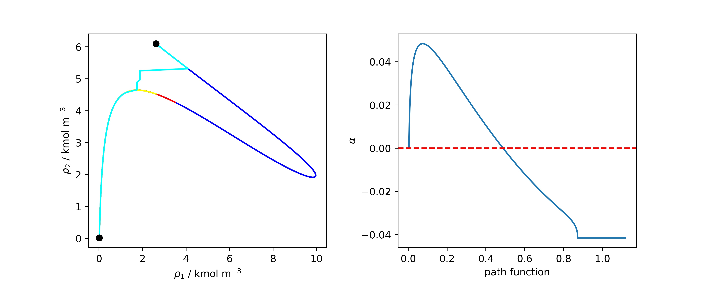

SGT for mixtures and :math:`\beta_{ij} = 0`
===========================================

When working with mixtures, SGT solution procedure depends wether the influece parameter matrix is singular or not. The geometric mean rule leads to a singular matrix when all :math:`\beta_{ij} = 0`. In those cases the boundary value problem (BVP) can not be solved and alternative methods has to be used. Some of the options are the reference component method, which is the most popular. For this method the following system of equations has to be solved:

.. math::
	\sqrt{c_r} \left[ \mu_j(\rho) -  \mu_j^0 \right] = \sqrt{c_j} \left[ \mu_r(\rho)  -  \mu_r^0 \right] \qquad j \neq r 

Where the subscript :math:`r` refers to the reference component and :math:`j` to the other components present in the mixture. Alought implementation of this method is direct it may not be suitable for mixtures with several stationary points in the interface. In those cases a path function is recommended, Cornellise's doctoral thesis proposed the following path function: 

.. math::
	(dh)^2 = \sum_i  c_{i} d\rho_i^2

Which increased monotonically from one phase to another. One of the disadvantages of this path function is that its final lenght is not known beforehand and an iterative procedure with nested for loops is needed. For some of these reasons, Liang proposed the following path function: 

.. math::
	h = \sum_i \sqrt{c_i} \rho_i

This path function has a known value when the equilibrium densities are available. Also the solution procedure allows to formulate a auxiliar variable :math:`\alpha = (\mu_i - \mu_i^0)/\sqrt{c_i}`. This variable gives information about whether the geometric mean rule is suitable for the mixture. 

The ``sgt_mix_beta0`` function allows to compute interfacial tension and density profiles using SGT and :math:`\beta_{ij} = 0`, its use is showed in the following code block for the mixture of ethanol and water:

>>> #component creation
>>> water =  component(name = 'Water', Tc = 647.13, Pc = 220.55, Zc = 0.229, Vc = 55.948, w = 0.344861,
                ksv = [ 0.87185176, -0.06621339],
                cii = [2.06553362e-26, 2.64204784e-23, 4.10320513e-21],
                GC = {'H2O':1})
>>> ethanol = component(name = 'Ethanol', Tc = 514.0, Pc = 61.37, Zc = 0.241, Vc = 168.0, w = 0.643558,
                ksv = [1.27092923, 0.0440421 ],
                cii = [ 2.35206942e-24, -1.32498074e-21,  2.31193555e-19],
                GC = {'CH3':1, 'CH2':1, 'OH(P)':1})
>>> mix = mixture(ethanol, water)
>>> mix.unifac()
>>> eos1 = prsveos(mix, 'mhv_unifac')
>>>T = 320 #K
>>> X = np.array([0.3, 0.7])
>>> P0 = 0.3 #bar
>>> Y0 = np.array([0.7, 0.3])
>>>#The full_output option allows to obtain the compositions and volume of the phases
>>> sol = bubblePy(Y0, P0, X, T, eos1, full_output = True)
>>> Y = sol.Y
>>> P = sol.P
>>> vl = sol.v1
>>> vv = sol.v2
>>> #computing the density vector
>>> rhol = X / vl
>>> rhov = Y / vv

As the equilibrium is already computed, the interfacial tension of the mixture can be calculated.

>>> #if reference component is set to ethanol (index = 0) a lower value is obtained as the 
>>> #full density profile was not calculated because of a stationary point in the interface
>>> solr1 = sgt_mix_beta0(rhov, rhol, T, P, eos1, s = 0, n = 100,
... method = 'reference', full_output = True)
>>> #water doesnt show surface activity across the interface
>>> #and the density profiles are fully calculated
>>> solr2 = sgt_mix_beta0(rhov, rhol, T, P, eos1, s = 1, n = 100,
...  method = 'reference', full_output = True)
>>> #Using Liang path function the density profiles are computed directly
>>> soll = sgt_mix_beta0(rhov, rhol, T, P, eos1, n= 500,
...  method = 'liang', full_output = True)
>>> #Cornelisse path function also allows to compute the density profiles
>>> solc = sgt_mix_beta0(rhov, rhol, T, P, eos1, n = 500,
... method = 'cornelisse', full_output = True)

The following results are obtanined from each method, it can be seen that the results from path functions as reference component with component two as reference are the same.

- Reference component method (1) :  15.8164 mN/m
- Reference component method (2) :  27.2851 mN/m
- Liang path Function :  27.2845 mN/m
- Cornelisse path Function :  27.2842 mN/m

The density profiles computed from each method are plotted in the following figure. The results obtained from Cornellise's path function, Liang's path function and Reference component method with water as reference component overlaps each other, as they compute the same density profile. When selection ethanol as reference component the black line is computed. The plot from the Liang's :math:`\alpha` parameter reveal that the geometric mixing rule is suitable for the computation of the density profile of this mixture. 

A more challenging mixture to analyze is ethanol and hexane. This mixture has several stationary points across the interface making its calculations tricky. Similar as before, equilibrium has to be computed. 

>>> hexane = component(name = 'n-Hexane', Tc = 507.6, Pc = 30.25, Zc = 0.266, Vc = 371.0, w = 0.301261, 
                ksv = [ 0.81185833, -0.08790848],
                cii = [ 5.03377433e-24, -3.41297789e-21,  9.97008208e-19],
                GC = {'CH3':2, 'CH2':4})
>> mix = mixture(ethanol, hexane)
>>> a12, a21 = np.array([1141.56994427,  125.25729314])
>>> A = np.array([[0, a12], [a21, 0]])
>>> mix.wilson(A)
>>> eos2 = prsveos(mix, 'mhv_wilson')
>>> T = 320 #K
>>> X = np.array([0.3, 0.7])
>>> P0 = 0.3 #bar
>>> Y0 = np.array([0.7, 0.3])
>>> sol = bubblePy(Y0, P0, X, T, eos2, full_output = True)
>>> Y = sol.Y
>>> P = sol.P
>>> vl = sol.v1
>>> vv = sol.v2
>>> #computing the density vector
>>> rhol = X / vl
>>> rhov = Y / vv

Similar as for the first example, all the posible methods will be tested.

>>> solr1 = sgt_mix_beta0(rhov, rhol, T, P, eos2, s = 0, n = 100, 
... method = 'reference', full_output = True)
>>> solr2 = sgt_mix_beta0(rhov, rhol, T, P, eos2, s = 1, n = 100, 
... method = 'reference', full_output = True)
>>> soll = sgt_mix_beta0(rhov, rhol, T, P, eos2, n= 500,
... method = 'liang', full_output = True)
>>> solc = sgt_mix_beta0(rhov, rhol, T, P, eos2, n= 500,
... method = 'cornelisse', full_output = True)

The interfacial tension result from each method are listed bellow. 

- Reference component method (1) :  12.9207 mN/m
- Reference component method (2) :  15.5870 mN/m
- Liang path Function :  12.99849 mN/m
- Cornelisse path Function :  15.64503 mN/m

It can be seen that each method computed a different value, an inspection on the calculated density profiles can help to decide if any of the is correct. Yellow line was computed with reference component 1, Cyan line was computed with reference component 2, Liang and Cornellise path function results are plotted with a red and blue line, respectively.  

Clearly, online Conrnelisse's path function was able to compute the density profiles of the mixture. An inspection on the :math:`\alpha` parameter from Liang's path function reveals that its final value is different than zero, when this method fail Liang states that geometric mean rule might no be suitable for the mixture and a :math:`\beta_{ij}` correction should be applied. 

.. automodule:: phasepy.sgt.sgt_beta0
    :members: sgt_mix_beta0
    :undoc-members:
    :show-inheritance:

Individual functions for each method can be accesed trought the :class:`phasepy.sgt.ten_beta0_reference` for reference component method, :class:`phasepy.sgt.ten_beta0_hk` for Cornellise path function,  :class:`phasepy.sgt.ten_beta0_sk` for Liang path function.

